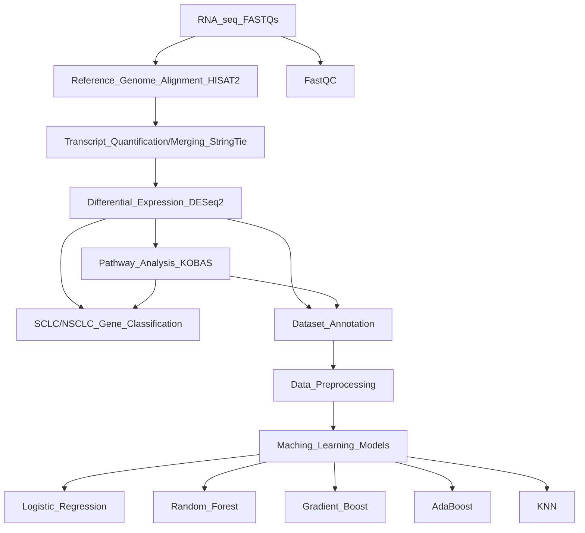
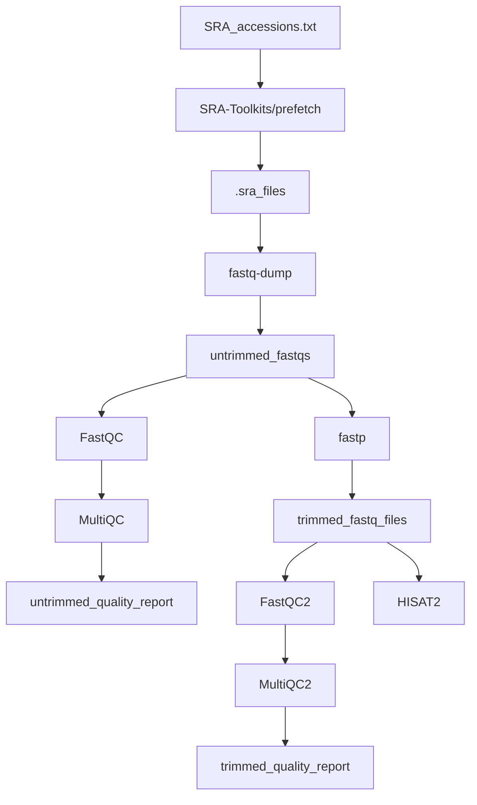

# ML-Final-Project

## Introduction

The inspiration for this project comes from the publication: Novel Biomarker Prediction for Lung Cancer Using Random Forest Classifiers
(https://www.ncbi.nlm.nih.gov/pmc/articles/PMC10126698/)

The data used for this analysis is Illumina Hiseq2500 RNA-seq data found at NCBI SRA under the project ID SRP117020. Samples were obtained from 130 patients diagnosed with non-small cell lung cancer (NSCLC).
The data contains sequences with distribution of poor to well differentiated adenocarcinomas and squamous cell cancers

The reference genome used for alignment can be found here: https://www.ncbi.nlm.nih.gov/assembly/GCF_000001405.26/.

### Project Overview 



#### Data Preparation (Part I)

Preparation of the data for the ML algorithms includes a pipeline containing various bioinformatics tools:


* To use SRA-Toolkits prefetch to retrieve all samples:
``` 
while read accession; do
  prefetch "$accession"
done < SRA_accessions.txt`
```

* To convert all paired sample .sra files to fastq files:
```
for dir in SRR*/; do
    echo "Processing $dir"
    fastq-dump --split-files --gzip "$dir/${dir%/}.sra"
done
```


* To trim all fastq samples:
```
for file in *_1.fastq; do
    base=$(basename "$file" "_1.fastq")
    fastp -i "${base}_1.fastq" -I "${base}_2.fastq" -o "../FASTQ_SAMPLES_TRIMMED/${base}_1_trimmed.fq" -O "../FASTQ_SAMPLES_TRIMMED/${base}_2_trimmed.fq"
done
```

* Align reads to the reference genome using `alignments.sh` script:
```
chmod +x alignment.sh
./alignment.sh
```
```
nm = NearMiss()
print('SCLC Original Shape:', Counter(sclc))
features_nm_sclc, nm_sclc = nm.fit_resample(features, sclc)
print('SCLC Resample Shape:', Counter(nm_sclc))
print('NSCLC Original Shape:', Counter(nsclc))
features_nm_nsclc, nm_nsclc = nm.fit_resample(features, nsclc)
print('NSCLC Resample Shape:', Counter(nm_nsclc))
```
